# Cloud Auto Scaling Monitoring (Terraform + ALB + ASG + CloudWatch)

This project demonstrates **CPU-based Auto Scaling** on AWS using **Terraform**, with an **Application Load Balancer (ALB)**, **Auto Scaling Group (ASG)**, **CloudWatch alarms/dashboard**, and a custom `/burn` endpoint for repeatable load generation.  
It also includes a **monitoring/event-logging pipeline** (Lambda + DynamoDB + email notifications) to improve visibility into scaling-related events and alarm activity.

---

## What’s included

- **Networking**: VPC, public + private subnets (2 AZ design), routing (private instances can install packages)
- **Compute**: ALB + Target Group + Listener, Launch Template, Auto Scaling Group
- **Scaling**: CloudWatch alarms on `CPUUtilization` + scale up/down policies
- **Observability**: CloudWatch Dashboard (CPU + instance counts)
- **Load trigger**: `/burn` endpoint proxied through nginx → python burner → `stress-ng`
- **Event logging & notifications**: CloudWatch alarm actions integrated with SNS / Lambda flow for logging scaling-related events, storing records in DynamoDB, and sending email notifications

---

## High-level architecture

Internet → **ALB (HTTP :80)** → **EC2 instances (ASG, private subnets)**  
On each instance:
- nginx serves `/`
- nginx proxies `/burn` to a local python service on `:9000`
- python service executes `stress-ng` for a short CPU spike

Monitoring / event flow:
- CloudWatch alarms evaluate CPU thresholds for the Auto Scaling Group
- Alarm transitions trigger scaling policies (scale out / scale in)
- Monitoring components can forward events for logging/notification (Lambda + DynamoDB + email subscription)

---

## Auto Scaling logic

- **Scale out**: CPUUtilization > **50%** for **2 datapoints** (period 60s)
- **Scale in**: CPUUtilization < **15%** for **5 datapoints** (period 60s)
- ASG bounds: `min=1`, `desired=1`, `max=3`

---

## Monitoring & event logging

In addition to scaling, the project includes monitoring-oriented components for visibility and notifications:

- **CloudWatch alarms** detect sustained high/low CPU utilization
- **Scaling policies** adjust ASG capacity (up/down)
- **Lambda (scale logger)** can process scaling/alarm-related events
- **DynamoDB** stores event/log records for later review
- **Email notifications** (via subscribed email) provide human-readable alerts

> Note: In this portfolio version, screenshots focus on the scaling workflow (ALB, ASG, CloudWatch dashboard, alarms, and activity history). (Which is a fancy way of saying: "Well... I forgot the screenshots from the database modul before destroy. I still have the e-mails though")

> DynamoDB / email evidence can be added later as optional screenshots or sample email captures.

---

## Repository structure

```text
## Repository structure

```text
cloud-autoscaling-monitoring/
├── main.tf
├── variables.tf
├── outputs.tf
├── providers.tf
├── user-data.sh
├── deploy.bat
├── destroy.bat
├── README.md
├── .terraform.lock.hcl
├── lambda/
│   ├── lambda_function.py
│   └── scale_logger.zip              # generated by deploy.bat
├── modules/
│   ├── network/
│   │   ├── main.tf
│   │   ├── variables.tf
│   │   └── outputs.tf
│   ├── compute/
│   │   ├── main.tf
│   │   ├── variables.tf
│   │   └── outputs.tf
│   └── monitoring/
│       ├── main.tf
│       ├── variables.tf
│       └── outputs.tf
└── screenshots/
    ├── terraform.PNG
    ├── alb.PNG
    ├── dashboard.PNG
    ├── alarms.PNG
    ├── cpu_high_alarm.PNG
    ├── cpu_low_alarm.PNG
    ├── asg_activity.PNG
    ├── load_balancer.PNG
    ├── load_balancer_target_group.PNG
    ├── burn_browser.PNG
    ├── burn_running.PNG
    ├── email.PNG
    └── burn_done.PNG
```

---

## Prerequisites

### Tools
- AWS account + credentials configured locally (AWS CLI / env vars)
- Terraform installed

### 1) Create `terraform.tfvars` (required)

Create a file named **`terraform.tfvars`** in the project root:

```hcl
aws_region = "eu-north-1" 

project     = "autoscaling-monitor"
environment = "dev"

# VPC
vpc_cidr = "10.10.0.0/16"

# TWO AZ DESIGN
public_subnet_cidrs = [
  "10.10.1.0/24",
  "10.10.2.0/24"
]

private_subnet_cidrs = [
  "10.10.11.0/24",
  "10.10.12.0/24"
]

alert_email = "YOUR_EMAIL_HERE"

ami_id        = "ami-0c83cb1c664994bbd"
instance_type = "t3.micro"
```

### Notes:
- Replace YOUR_EMAIL_HERE with your email.
- The ami_id must exist in your region (example above is for eu-north-1). You can find the correct ami_id and copy paste it at the AWS console at the EC2 deployment section.

### Email alert setup (important)
- `alert_email` is used for monitoring notifications.
- After deployment, AWS sends a **subscription confirmation email**.
- You must **confirm the subscription**; otherwise email alerts will not be delivered.

## Deploy

### Option A (recommended): One-click deploy on Windows
Run:
```powershell
./deploy.bat
```

deploy.bat (reference)

```powershell
@echo off
cd /d %~dp0

echo 1) Package Lambda into .\lambda\scale_logger.zip
powershell -Command "Compress-Archive -Path lambda\lambda_function.py -DestinationPath lambda\scale_logger.zip -Force"

echo 2) Terraform init
terraform init

echo 3) Terraform validate
terraform validate || exit /b 1

echo 4) Terraform plan
terraform plan -out=tfplan || exit /b 1

echo 5) Terraform apply
terraform apply tfplan

echo Deploy complete!
pause
```
#### What it does (high level):
- Packages the Lambda source (`lambda/scale_logger.zip`) used by the monitoring/event-logging pipeline
- Runs terraform init
- Runs terraform validate (fails fast on syntax/config errors)
- Creates a saved plan (tfplan) and applies it

### Option B: Manual terraform commands
```powershell
terraform init
terraform apply
```
After apply, open the ALB DNS output in the browser.

## Test endpoints

- Homepage
http://"insert alb-dns from outputs from the end of deploy"/

- CPU burn trigger
http://"insert alb-dns from outputs from the end of deploy"/burn

- Expected response:
Burn started

## Load testing (memory-friendly PowerShell)

This avoids spawning thousands of jobs.
It creates a fixed number of workers that keep calling /burn for ~8 minutes.

```powershell
$uri = "http://<alb-dns>/burn"
$minutes    = 8
$workers    = 80
$pauseMs    = 50
$timeoutSec = 5

Write-Host "Starting load: $minutes min, workers=$workers, pause=${pauseMs}ms"

$jobs = 1..$workers | ForEach-Object {
    Start-Job -ArgumentList $uri,$minutes,$pauseMs,$timeoutSec -ScriptBlock {
        param($u,$mins,$pause,$timeout)
        $end = (Get-Date).AddMinutes($mins)
        while ((Get-Date) -lt $end) {
            try { Invoke-WebRequest $u -UseBasicParsing -TimeoutSec $timeout | Out-Null } catch {}
            Start-Sleep -Milliseconds $pause
        }
    }
}

$endMain = (Get-Date).AddMinutes($minutes)
while ((Get-Date) -lt $endMain) {
    $running = ($jobs | Where-Object { $_.State -eq "Running" }).Count
    $failed  = ($jobs | Where-Object { $_.State -eq "Failed" }).Count
    Write-Host ("...still running ({0}/{1} workers), failed={2}" -f $running,$workers,$failed)
    Start-Sleep -Seconds 10
}

$jobs | Wait-Job | Out-Null
$jobs | Remove-Job
Write-Host "DONE"
```

## Evidence (screenshots)

> Screenshots in this README focus on the Auto Scaling test flow (ALB, ASG, CloudWatch dashboard, alarms, activity history, and load generation).  
> The project also includes event logging/notification components (Lambda + DynamoDB + email), but those artifacts are not shown here because the environment was destroyed after validation.

Terraform applied successfully
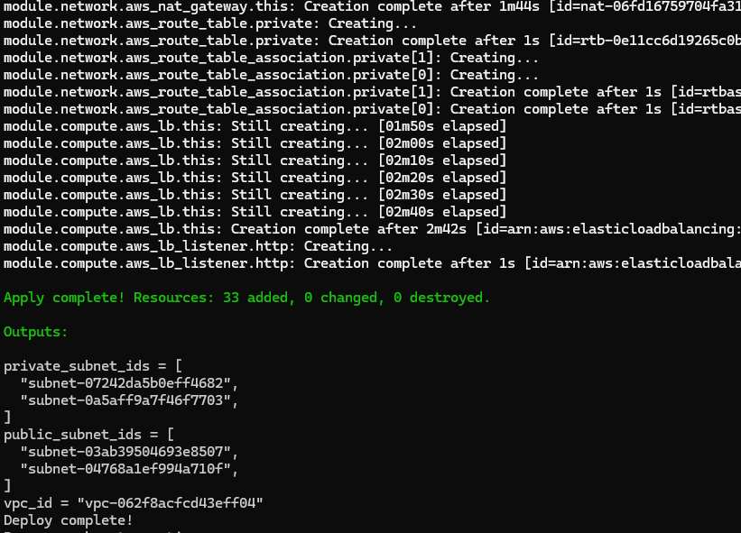
ALB serves the homepage
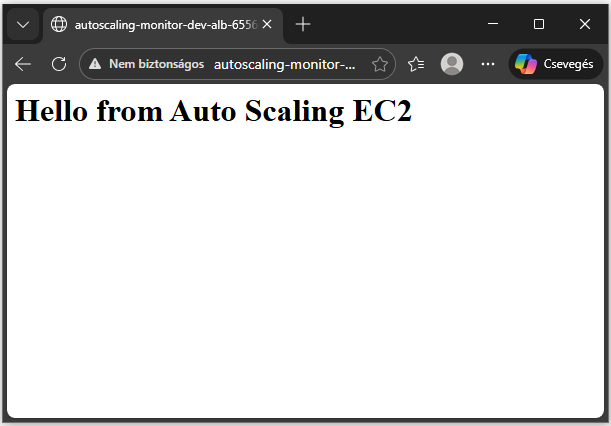
/burn endpoint works in browser
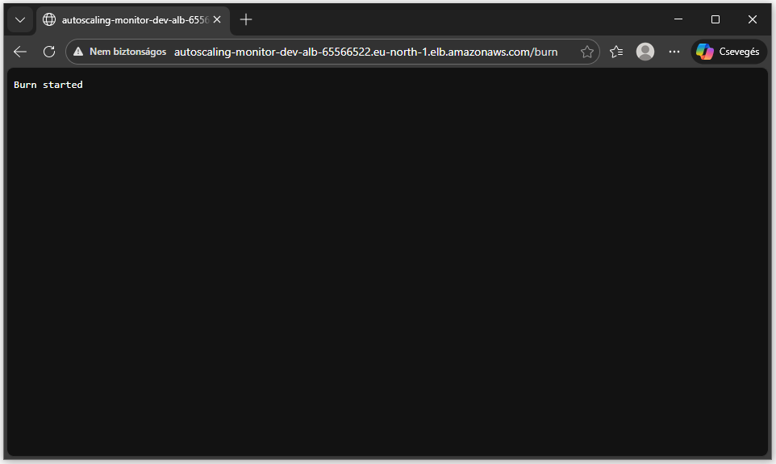
Dashboard: CPU spike + instance count changes
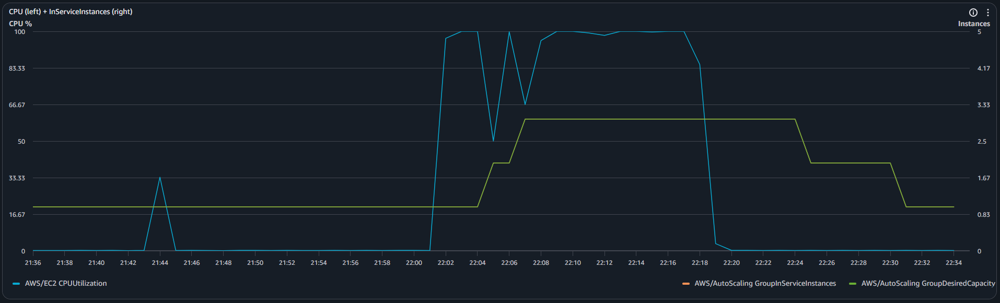
Auto Scaling activity history (scale out / scale in)
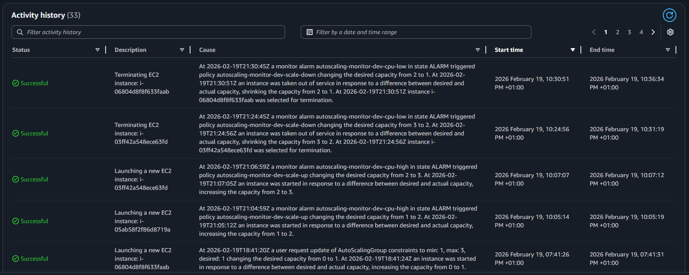
CloudWatch alarms overview + history
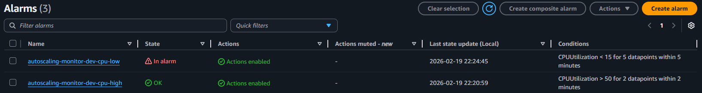
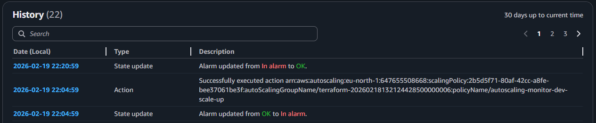
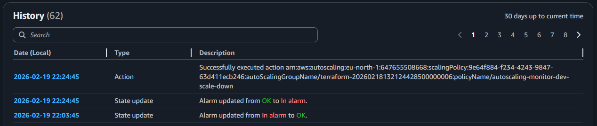
Load generator running / finished
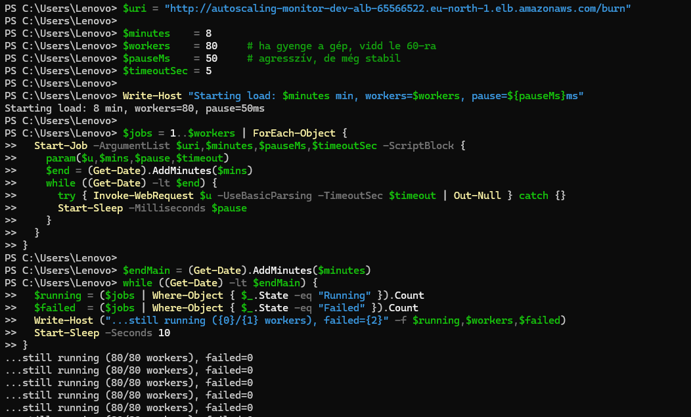
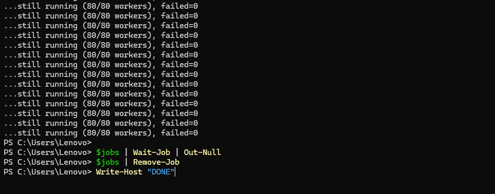
ALB / Target Group monitoring
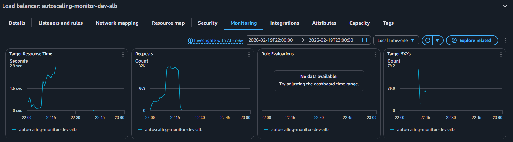
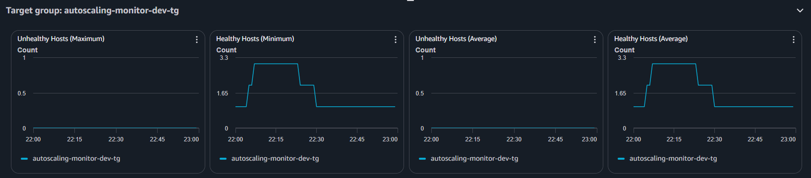
Example email notification received from the monitoring pipeline
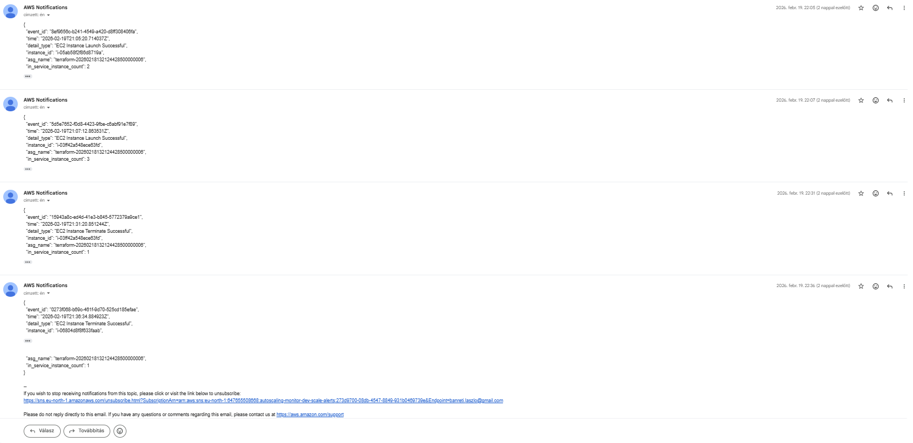

## Optional evidence (monitoring notifications)

If you want to extend the README later, useful additional evidence includes:
- DynamoDB table screenshot showing logged events (timestamps, alarm names, actions)
- CloudWatch Logs screenshot for the Lambda function execution

## Cost warning (important)

This project uses AWS resources that can generate non-trivial costs if left running:
- NAT Gateway (hourly + data processing)
- Application Load Balancer (hourly + LCU usage)
- EC2 instances (small cost if t3.micro, more if scaled to 2–3)
- CloudWatch metrics/dashboards (usually small)
- Lambda / SNS / DynamoDB (usually low cost in a small lab, but still billable)

Recommendation for test pourpouses: deploy, run the test (takes ~20 minutes to scale up, then back down. drink a coffee), make observations, then destroy immediately.

## Estimated cost (rough order-of-magnitude)

Exact pricing depends on region and usage. The biggest cost drivers are NAT Gateway and ALB.

Typical ballpark if left running 24/7:
- NAT Gateway: often tens of USD / month
- ALB: often tens of USD / month
- EC2 (t3.micro): single-digit to low tens USD / month depending on uptime
- CloudWatch: usually small

Lambda, SNS, and DynamoDB are typically low-cost for this type of short demo workload, but they should still be included in cost awareness.

If you run it only for a short lab session (e.g., 1–2 hours), cost is typically very low, but NAT/ALB still bill hourly.

## Cleanup (avoid costs)

### Option A (recommended): One-click destroy on Windows

Run:
```powershell
./destroy.bat
```
destroy.bat (reference)
```powershell
@echo off
cd /d %~dp0

echo Destroying infrastructure...
terraform destroy -auto-approve

echo All resources deleted.
pause
```
### Option B: Manual terraform destroy
```powershell
terraform destroy
```
## Notes / troubleshooting

- Scale-out might not trigger if CPU spikes are too short. The alarm requires sustained threshold breaches.
- Scale-in typically takes longer due to evaluation windows and cooldown.
- Instances are in private subnets, so outbound package installs require correct routing/NAT.
- If email alerts do not arrive, check whether the SNS/email subscription was confirmed.
- If event logs are missing, verify Lambda execution logs and IAM permissions for DynamoDB write access.

## 👤 Author

László Banréti
Aspiring Cloud Engineer